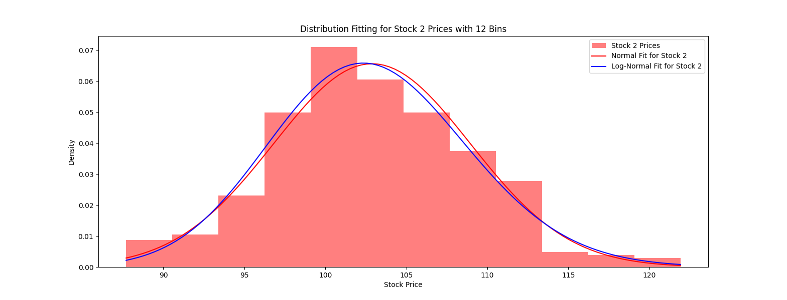

# Assignment_3_Options_As_A_Financial_Tool

Group Members:
- TODO: Add your name here
- Chase Mortensen
- Michael Grajera
- Anthony Wilson

## Running the program

In order to run the program, install the following packages: `pandas`, `matplotlib`, `numpy`, `numba`, and `scipy`.

Then, run

```sh
python main.py
```

You may comment out specific sections in the `main` function.

## Part 1: Fitting Stock Data to Distributions

__Task:__ Provide a plot showing the stock data overlaid with the fitted distributions.


<p align="center">Fig. 1. Stock 1 with Normal and Log-Normal Distributions overlaid over a histogram with 12 bins.</p>


<p align="center">Fig. 2. Stock 2 with Normal and Log-Normal Distributions overlaid over a histogram with 12 bins.</p>

Note: More graphs are included in the `img` folder that include the same distributions with varying bins. 12 bins seems to show the distribution but the other graphs are also helpful.

__Task:__ Report on the best-fitting distributions for both stocks and the metrics used to measure the goodness of fit.

First, visually comparing the Normal and Log-Normal distributions for each graph reveals a slight right-skew on both of the Log-Normal overlays, which seems to fit the data better in both instances. The peak of the Log-Normal distributions in both cases also seems to be slightly less than the Normal distributions.

The Kolmogorov-Smirnov test gives us the following data:

### Stock 1
- Normal Distribution
  - K-S Statistic: 0.032
  - p-value 0.832
- Log-Normal Distribution
  - K-S Statistic: 0.025
  - p-value 0.973

The Log-Normal has a lower K-S statistic and higher p-value, which signifies a better fit for the Log-Normal distribution for Stock 1.

### Stock 2
- Normal Distribution
  - K-S Statistic: 0.036
  - p-value 0.719
- Log-Normal Distribution
  - K-S Statistic: 0.025
  - p-value 0.974

Again, the Log-Normal distribution has a lower K-S statistic and higher p-value than the Normal distribution, so it is also a better fit for the Stock 2 data.

## Part 2: Monte Carlo Simulation for Vanilla European Option Pricing

__Task:__ Write Python code to simulate the 5000 Monte Carlo simulations and compute the European option price.


<p align="center">Fig. 3. Monte Carlo simulated stock paths charted.</p>


<p align="center">Fig. 4. Distribution of final stock prices at maturity.</p>

The following are the paramaters were used for the above graphs:
<ul>
<li>The asset follows a beta distribution with parameters (9, 10), shifted to the left by 0.35.</li>
<li>Volatility is 17.04 </li>
<li>Drift is 0.03.</li>
<li>The option matures in 1 year (365 days).</li>
<li>The initial stock price is $100.</li>
<li>The strike price is $100</li>
<li>Risk-free interest rate of 2%</li>
</ul>

According to our simulation:

1. Average stock price after 365 days: 102.78
2. Average payoff (before discounting): 8.24
3. Cost of the option (discounted payoff): 8.08

## Part 3: Stochastic Jumps and Basket Option Pricing

__Task:__ Write python code to simulate and compare the stocks using the best-fitting distributions (part 1) and The Monte Carlo simulations (part 2) with basket options.


<p align="center">Fig. 5. Distribution of Final Stock Prices at Maturity (Best Fit Distribution vs Monte Carlo with Basket Options).</p>

Option price for Average value: 6.45
Option price for Maximum value: 14.22

After running the simulation repeatedly, the results reflect the graph and the Option prices above with minor variance, showing that the Monte Carlo simulation with the basket options comes out on top on average about 8-10$ higher.
